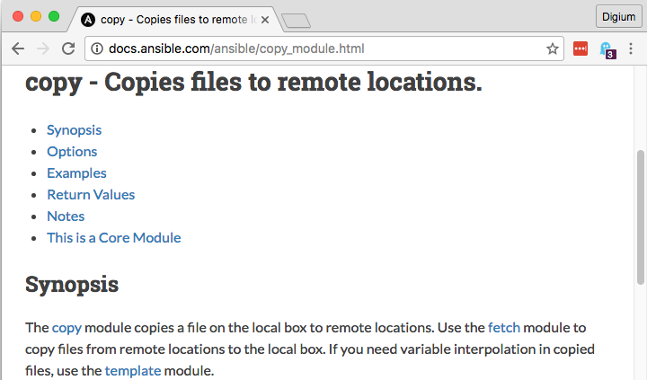
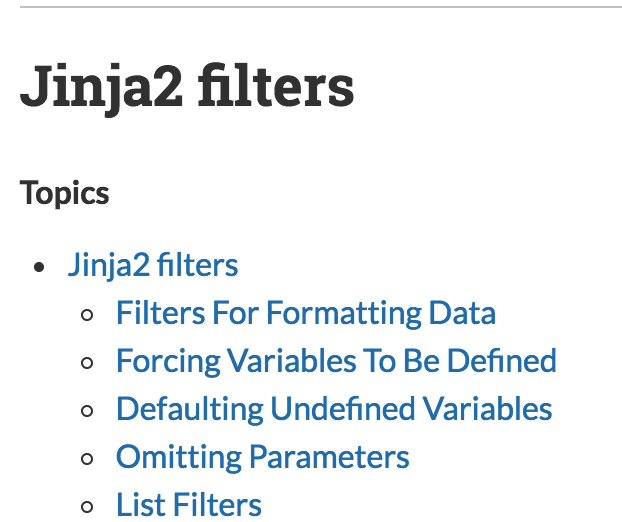

<!-- Written with Marp: https://yhatt.github.io/marp/ -->
<!-- $theme: default -->

# Simply Ansible: Getting Started

> Getting started with Ansible

<small>David M. Lee, II
[@leedm777](https://github.com/leedm777) GitHub
[@leedm777](https://twitter.com/leedm777) Twitter
[leedm777@yahoo.com](mailto:leedm777@yahoo.com)</small>

---

# `new Ansible()`

> Ansible is an IT automation tool. It can configure systems, deploy software, and orchestrate more advanced IT tasks such as continuous deployments or zero downtime rolling updates.

---

# Why?

Codifying infrastructure allows you to take advantage of software development principles and techniques.

 * Automation: do more with less
 * Improve reliability: it happens the same way every time
 * Peer review; revision control; automated validation; ...

---

# Ansible basics

 * Ansible uses [YAML](http://www.yaml.org/spec/1.2/spec.html) for pretty much everything
   * Except for the occasional [INI format](https://docs.python.org/2/library/configparser.html)
 * Templates are written in [Jinja2](http://jinja.pocoo.org/docs/dev/) template language
   * Can show up in `.yml` files. Much fun!
 * Requires Python 2.x, on both control machine and managed nodes
   * No agent required on managed nodes
   * Modules may require certain libraries/apps to be installed

---

# Using Ansible


---

## `ansible` - ad hoc commands

Handy, but use sparingly. Changes to systems should be done through playbooks.

```bash
$ ansible all \
>  --module-name command \
>  --args "uname -a"
services | SUCCESS | rc=0 >>
Linux services 3.2.0-107-virtual #148-Ubuntu SMP Mon Jul 18 21:47:32 UTC 2016 x86_64 x86_64 x86_64 GNU/Linux

mariadb | SUCCESS | rc=0 >>
Linux mariadb 3.2.0-107-virtual #148-Ubuntu SMP Mon Jul 18 21:47:32 UTC 2016 x86_64 x86_64 x86_64 GNU/Linux

pdns | SUCCESS | rc=0 >>
Linux pdns 3.10.0-327.22.2.el7.x86_64 #1 SMP Thu Jun 23 17:05:11 UTC 2016 x86_64 x86_64 x86_64 GNU/Linux
```

---

## `ansible-playbook` - what you really want

The `ansible-playbook` command executes the tasks specified in the playbook, in order, against the managed hosts.

```bash
$ ansible-playbook site.yml
PLAY [Do the thing] ************************************************************

TASK [setup] *******************************************************************
ok: [mariadb]
ok: [services]
ok: [pdns]

TASK [The thing] ***************************************************************
ok: [mariadb]
ok: [services]
skipped: [pdns]
```

---

# Anatomy of an Ansible project


---

# Inventory

## The list of managed hosts

Can be static (in a `.ini` file) or dynamic (results of a `.py` inventory script).

```
# ./inventory/vagrant.ini
[services]
services ansible_host=192.168.98.100

[mariadb]
mariadb ansible_host=192.168.98.200
```

---

# Variables

 * Values that may vary per system
   * About a zillion different places to specify vars
   * Please don't use _all_ of them
 * Vaults: encrypted vars file

```yaml
# ./group_vars/all/main.yml
---
# default to direct mail delivery.
# if you have a relay, set it here.
smtp_relay_host: ''

# Use for NODE_ENV, RAILS_ENV, RACK_ENV, etc.
app_env: development
```

---

# Modules

Programs that Ansible executes directly on remote hosts.

 * Ansible ships with >600 modules.
 * [Custom modules](http://docs.ansible.com/ansible/developing_modules.html) can be loaded in the `./library` directory.
 * Very [well documented](http://docs.ansible.com/ansible/list_of_all_modules.html) on ansible.com



---

# Tasks

A task specifies a module and the parameters to invoke it with.

```yaml
- name: perform an action
  # args can be name=value
  copy: src=blink.conf dest=/etc/angels

- name: perform another action
  # or args can be an object
  copy:
    src: blink.conf
    dest: /etc/angels
```

---

# Blocks

A block can used anywhere you can use a task. It allows you to more easily apply settings to a group of tasks. It also adds `rescue` blocks for error handling. New in Ansible 2.x.

```yaml
- when: doctor == 10
  block:
   - name: Copy rose.conf to /etc/doctor/companions.d/
     copy: src=rose.conf dest=/etc/doctor/companions.d/
   - name: Set catchphrase to allons-y
     copy: src=allons-y.conf dest=/etc/doctor/catchphrase.conf

```

---

# Roles

A role is a list of tasks, which are executed sequentially, in order. Plus some other stuff.

```bash
site.yml
roles/
   some-role/
     tasks/
       main.yml # tasks go in here
     defaults/
       main.yml # role-specific vars go in here
     handlers/
       main.yml # tasks that are triggered optionally
                #   i.e. service restarts
     files/
       ...      # content for copy/script tasks
     templates/
       ...      # content for template tasks
                #   always append .j2 to filenames
```

---

# Plays

A play specifies which roles (in order) to run on which hosts. The host list has [an elaborate syntax](http://docs.ansible.com/ansible/intro_patterns.html) which can specify pretty much anything you want.

```yaml
- name: Some play
  hosts: some-hosts:!not-these-hosts
  roles:
   - some-role
   - some-other-role
```

---

# Playbooks

A playbook is a list of plays, which are executed sequentially, in order.

```yaml
# ./site.yml
---
- name: First play
  hosts: some-hosts
  roles:
   - some-role

- name: Second play
  # ...
```

---

## Templates

[Jinja2 syntax](http://jinja.pocoo.org/docs/dev/templates/) is used in `.j2` template files, or in task definitions.

```yaml
- name: perform an action
  action:
    some_param: '{{ some_var }}'
    #           ^              ^
    #           in YAML, quotes are
    #           usually necessary to
    #           avoid yaml/j2 confusion
```

---

## Custom Jinja2 filters

In addition to the standard Jinja2 filters, Ansible defines a [number of custom filters](https://docs.ansible.com/ansible/playbooks_filters.html).



---

## Handlers

Handlers allow you to perform actions on change.

 * If handler isn't notified, it isn't run
 * If it's notified multiple times, it only runs once
 * When run, handlers run at the end of the play
 * **Caution**: Be sure to set `force_handlers = true` in `ansible.cfg`
   * Otherwise errors between notify and end of play cause handlers to be skipped

```yaml
# ./some-role/tasks/main.yml
- copy: src=missy.conf dest=/etc/master
  notify: restart master

# ./some-role/handlers/main.yml
- name: restart master
  service: name=master state=restarted
```

---

## Parameterized Roles

A role may be parameterized, meaning that it expects certain variables to be set.

```yaml
- role: rvm_io.rvm1-ruby
  rvm1_autolib_mode: 4 # automatically install deps
  rvm1_rubies: ['ruby-2.3.1', 'ruby-2.2.5']
```

---

## Sharing roles

 * Common roles can be shared via [Ansible galaxy](https://galaxy.ansible.com/) or [git repo](http://docs.ansible.com/ansible/galaxy.html#installing-multiple-roles-from-multiple-files)
 * BUT... they tend to be very small, poorly versioned, and so poorly maintained, this is rarely useful
   * Don't use a role from Galaxy unless it has tagged versions
   * AND it looks like someone loves and cares for it
   * Otherwise, learn what you can from it and write your own

---

# Tags and limits

[Tags](http://docs.ansible.com/ansible/playbooks_tags.html) specify which tasks to run. [Limits](http://docs.ansible.com/ansible/intro_patterns.html) specifies which hosts to run those tasks on.

```bash
# run entire playbook on single machine
$ ansible-playbook site.yml --limit strax

# run everything task tagged with sontaran
$ ansible-playbook site.yml --tags sontaran

# run sil and ood on the webservers not in San Diego
$ ansible-playbook site.yml --tags sil,ood \
>   --limit webservers:!san-diego
```

---

# Secret Variables: Ansible Vault

The `ansible-vault` command can be used to manage encrypted files. Put any secrets for a given environment in a `vault.yml` file in that environment's `group_vars`.

```bash
# create a vault
$ ansible-vault create group_vars/${ENV}/vault.yml
# edit a vault
$ ansible-vault edit group_vars/${ENV}/vault.yml
```

---

# Usable vaults: [`ansible-vault-tools`](https://github.com/building5/ansible-vault-tools)

Problem: vaults are just blobs of hex. `ansible-vault-tools` to the rescue!

 * `ansible-vault-merge` - magical vault merging
 * `ansible-vault-textconv` - magical vault diffing
   * And `git grep --textconv` can search in vaults!
 * `gpg-vault-password-file` - encrypt your vault password file

```
$ANSIBLE_VAULT;1.1;AES256
deaddeaddeaddeaddeaddeaddeaddeaddeaddeaddead
deaddeaddeaddeaddeaddeaddeaddeaddeaddeaddead
```

---

# Task attributes

Task attributes can also be applied to blocks, roles and plays.

 * `no_log` - omit output when running the play
 * `become` - control which user runs the task(s)
 * `when` - conditionally runs the task(s)
 * `delegate_to`, `run_once`, `serial` - control task execution

---

## `no_log`: keep it secret, keep it safe

Adding `no_log` to a task ensures that any secrets don't get printed to the console when you run the playbook.

```yaml
- copy: content={{ doctors_name }} dest=/etc/doctor/name
  no_log: True
```

---

## To `become`, or not `become`

By default, Ansible runs modules as the unprivileged user. The `become` setting changes that.

 * Can be specified in `ansible.cfg`, on a play, on a task, on the command line
 * Can specify `become_user` to become a user other than `root`

---

## Conditionals

On tasks, block, roles or plays, you can add a `when` clause to conditionally do something.

```yaml
- when: ansible_distribution == 'Ubuntu'
  apt: name=postfix

- when: ansible_distribution == 'CentOS'
  yum: name=postfix
```

---

## Task execution control

 * `delegate_to` - run the task once, on the specified host
 * `run_once` - run the task once, on the first host in the group
   * useful for running database migrations
 * `serial` - run the task on batches of servers
   * `1` - run on one host at a time
   * `20%` - run on 20% of the hosts at a time

---

# Questions


---

# Thanks!


<small>David M. Lee, II
[@leedm777](https://github.com/leedm777) GitHub
[@leedm777](https://twitter.com/leedm777) Twitter
[leedm777@yahoo.com](mailto:leedm777@yahoo.com)</small>
