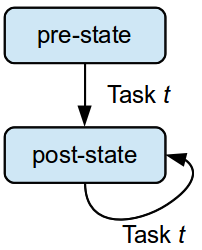

<!-- Written with Marp: https://yhatt.github.io/marp/ -->
<!-- $theme: default -->

# Simply Ansible

> Getting started with Ansible best practices

<small>David M. Lee, II
[@leedm777](https://github.com/leedm777) GitHub
[@leedm777](https://twitter.com/leedm777) Twitter
[leedm777@yahoo.com](mailto:leedm777@yahoo.com)</small>

---

# `new Ansible()`

> Ansible is an IT automation tool. It can configure systems, deploy software, and orchestrate more advanced IT tasks such as continuous deployments or zero downtime rolling updates.

---

# Ansible basics

 * Ansible uses [YAML](http://www.yaml.org/spec/1.2/spec.html) for pretty much everything
   * Except for the occasional [INI format](https://docs.python.org/2/library/configparser.html)
 * Templates are written in [Jinja2](http://jinja.pocoo.org/docs/dev/) template language
   * Can show up in `.yml` files. Much fun!
 * Requires Python 2.x, on both control machine and managed nodes
   * No agent required on managed nodes
   * Modules may require certain libraries/apps to be installed

---

# Using Ansible


---

## `ansible` - ad hoc commands

Handy, but use sparingly. Changes to systems should be done through playbooks.

```bash
$ ansible all \
>  --module-name command \
>  --args "uname -a"
services | SUCCESS | rc=0 >>
Linux services 3.2.0-107-virtual #148-Ubuntu SMP Mon Jul 18 21:47:32 UTC 2016 x86_64 x86_64 x86_64 GNU/Linux

mariadb | SUCCESS | rc=0 >>
Linux mariadb 3.2.0-107-virtual #148-Ubuntu SMP Mon Jul 18 21:47:32 UTC 2016 x86_64 x86_64 x86_64 GNU/Linux

pdns | SUCCESS | rc=0 >>
Linux pdns 3.10.0-327.22.2.el7.x86_64 #1 SMP Thu Jun 23 17:05:11 UTC 2016 x86_64 x86_64 x86_64 GNU/Linux
```

---

## `ansible-playbook` - what you really want

The `ansible-playbook` command executes the tasks specified in the playbook, in order, against the managed hosts.

```bash
$ ansible-playbook site.yml
PLAY [Do the thing] ************************************************************

TASK [setup] *******************************************************************
ok: [mariadb]
ok: [services]
ok: [pdns]

TASK [The thing] ***************************************************************
ok: [mariadb]
ok: [services]
skipped: [pdns]
```

---

# Anatomy of an Ansible project


---

# Inventory

## The list of managed hosts

Can be static (in a `.ini` file) or dynamic (results of a `.py` inventory script).

```
# ./inventory/vagrant.ini
[services]
services ansible_host=192.168.98.100

[mariadb]
mariadb ansible_host=192.168.98.200
```

---

# Variables

 * Values that may vary per system
   * About a zillion different places to specify vars
   * Please don't use _all_ of them

```yaml
# ./group_vars/all/main.yml
---
# default to direct mail delivery.
# if you have a relay, set it here.
smtp_relay_host: ''

# Use for NODE_ENV, RAILS_ENV, RACK_ENV, etc.
app_env: development
```

---

# Secret Variables: Ansible Vault

The `ansible-vault` command can be used to manage encrypted files. Put any secrets for a given environment in a `vault.yml` file in that environment's `group_vars`.

```bash
# create a vault
$ ansible-vault create group_vars/${ENV}/vault.yml
# edit a vault
$ ansible-vault edit group_vars/${ENV}/vault.yml
```

---

# Playbook

A playbook is a list of plays, which are executed sequentially, in order.

```yaml
# ./site.yml
---
- name: Some play
  hosts: some-hosts
  roles:
   - some-role

- name: Some other play
  # ...
```

---

# Play

A play is a list of roles, which are executed sequentially, in order.

```yaml
- name: Some play
  hosts: some-hosts
  roles:
   - some-role
   - some-other-role
```

---

# Role

A role is a list of tasks, which are executed sequentially, in order. Plus some other stuff.

```bash
site.yml
roles/
   some-role/
     tasks/
       main.yml # tasks go in here
     vars/
       main.yml # role-specific vars go in here
     handlers/
       main.yml # tasks that are triggered optionally
                #   i.e. service restarts
     files/
       ...      # content for copy/script tasks
     templates/
       ...      # content for template tasks
                #   always append .j2 to filenames
```

---

# Parameterized Role

A role may be parameterized, meaning that it expects certain variables to be set.

```yaml
- role: rvm_io.rvm1-ruby
  rvm1_autolib_mode: 4 # automatically install deps
  rvm1_rubies: ['ruby-2.3.1', 'ruby-2.2.5']
```

---

# Sharing roles

 * Common roles can be shared via [Ansible galaxy](https://galaxy.ansible.com/) or [git repo](http://docs.ansible.com/ansible/galaxy.html#installing-multiple-roles-from-multiple-files)
 * BUT... they tend to be very small, poorly versioned, and so poorly maintained, this is rarely useful
   * Don't use a role unless it has tagged versions
   * AND it looks like someone loves and cares for it
   * Otherwise, learn what you can from it and write your own

---

# Task

A task specifies a module and the parameters to invoke it with. The task is executed in parallel on every matching host for that play.

```yaml
- name: perform an action
  # args can be name=value
  action: some_param=some-value

- name: perform another action
  # or args can be an object
  action:
    some_param: some-value
```

---

# Block

A block can all you to more easily apply settings to a group of tasks. Also adds `rescue` blocks for error handling. New in Ansible 2.x.

```yaml
- when: some_var == 'some-val'
  block:
   - name: conditionally do a thing
     action: some_param=some-value
   - name: conditionally do another thing
     another_action: some_param=some-value
```

---

# Template

You can use [Jinja2 syntax](http://jinja.pocoo.org/docs/dev/templates/) in `.j2` template files, or in task definitions.

```yaml
- name: perform an action
  action: some_param='{{ some_var }}'
  #                  ^              ^
  #                  in YAML, quotes are
  #                  usually necessary to
  #                  avoid yaml/j2 confusion
```

---

# Tags and limits

[Tags](http://docs.ansible.com/ansible/playbooks_tags.html) specify which tasks to run. [Limits](http://docs.ansible.com/ansible/intro_patterns.html) specifies which hosts to run those tasks on.

```bash
# run entire playbook on single machine
$ ansible-playbook site.yml --limit some-new-machine

# run everything tagged with sontaran on all machines
$ ansible-playbook site.yml --tags sontaran

# run sil and ood on the webservers not in San Diego
$ ansible-playbook site.yml --tags sil,ood \
>   --limit webservers:!san-diego
```

---

# PROTIPS


---

## Put tasks in roles, not the playbook

While you can list tasks directly in a play, you're usually better off putting the task off in a role.

```yaml
# ./site.yml
- name: Some play
  hosts: some-hosts
  pre_tasks:        # meh
   - name: some pre_task
  roles:
   - some-role
  tasks:            # really?
   - name: some task
  post_tasks:       # PLEASE STOP!
   - name: some post_task
```

---

## Really, keep tasks in roles

Besides, content from Ansible Galaxy can only be brought in as a role, so trying to sort that into existing `{pre,post}_tasks` is a pain.

```yaml
- name: Some play
  hosts: some-hosts
  pre_tasks:
   # but what if I wanted to call a galaxy role
   # before this?
   - name: some pre_task
  post_tasks:
   - name: some post_task
   # or maybe a role after this?
```

---

## Keep roles small and single purpose

If the playbook is your 'program', then roles are your 'functions'.

 * For example, `pip`, `firewall`, `nodejs`, `timezone`, `auton`
 * Not things like `common`, `general`, `misc`, ...
 * Keep them small; most will fit on the screen

---

## Bending the rule: `debug-tools`

I usually have a rule with a bunch of one-line installers for things that are generally useful for debugging. But if you can't install it with a single `apt`, `pip`,`npm`, `gem`, etc., then it gets its own role.

```yaml
# ./roles/debug-tools/tasks/main.yml
- when: ansible_distribution == 'Ubuntu'
  name: apt-get install <cool-stuff>
  apt: name={{ item }}
  with_items:
    - curl
    - htop
    - iotop
    - jq
    # ...
```

---

## Avoid repeating roles...

Here both `foo` and `bar` need `zygon`. Since plays are sequential, `zygon` will be installed in sequence. Can really slow down the playbook.

```yaml
- hosts: foo
  roles:
   - zygon # Bad!
   - foo

- hosts: bar
  roles:
   - zygon # Bad!
   - bar
```

---

## i.e., consolidate roles to get parallelism

Since the `zygon` role is in a single play, it will execute in parallel on both `foo` and `bar`. You can't always do this, but when you can, it helps tremendously.

```yaml
- hosts: foo,bar # both foo and bar groups
  roles:
   - zygon    # installs in parallel
              # across foo & bar nodes

- hosts: foo
  roles:
   - foo

- hosts: bar
  roles:
   - bar
```

---

## Tag each role with the role's name

By keeping tag names consistent with role names, it's easier to keep track of what tags you have.


```yaml
# ./roles/zygon/tasks/main.yml
---
- tags: zygon
  block: # Ansible 2.x syntax
   - name: First zygon invasion
     # ...
```

Since roles are small and single purpose, you're usually debugging individual roles.

```bash
$ ansible-playbook site.yml --tags zygon
```

---

## Role tagging in Ansible 1.9

Before Ansible 2.x, the best way to tag an entire role was to put the tag in the playbook. Either way is fine.

```yaml
roles:
 - { role: zygon, tags: zygon } # Ansible 1.9 syntax
```

---

## Don't put tons of tags on a task

If you find yourself putting lots of tags on a task, you're probably doing it wrong. A tag should be there for a reason.

```yaml
  tags:
   - provision # okay, but every task in the
               #   playbook is for provisioning
   - bamboo    # and everything is for bamboo
   - bamboo-agent
               # what are you doing?
   - bamboo-agent-ubuntu
               # wait...
   - bamboo-agent-ubuntu-precise
               # MAKE IT STOP
   - bamboo-agent-ubuntu-precise-provision
               # *sigh*
```

---

## Put variable definitions in the right spot

```bash
site.yml        # in the occasional vars block
                # for parameterized roles
group_vars/
  all/
    main.yml    #   default values
    ...         #   can break into multiple files
  staging/      # Have a group for each environment
    main.yml    #   override defaults for env
    vault.yml   #   safe place for secrets
roles/
   kandy-man/
     vars/
       main.yml # specific vars for the role
                # version numbers, SHA hashes, etc.
```

---

## Vaults: too many vaults will kill you

 * We tried having single-var per vault
   * PRO: Avoids merge conflicts w/ vaults
   * CON: No one follows the rules
     * Vars end up in random vaults
     * Or var was renamed and vault wasn't
     * Grep is either powerless, or really slow
 * Use [ansible-vault-tools](https://github.com/building5/ansible-vault-tools) and as few vaults as possible
   * Single vault per `group_vars`
   * `ansible-vault-merge` - magical vault merging
   * `ansible-vault-textconv` - magical vault diffing
     * And `git grep --textconv` can search in vaults!

---

## !!!ENCRYPT YOUR VAULT PASSWORD!!!

The `ansible-vault-tools` project also provides `gpg-vault-password-file`, which can use your PGP key to encrypt your vault password.
 * You do [have a PGP key](https://help.github.com/articles/generating-a-new-gpg-key/), right?
 * And it's [encrypted with a passphrase](https://xkcd.com/936/)?
 * And you use [gpg-agent](https://www.gnupg.org/documentation/manuals/gnupg/Invoking-GPG_002dAGENT.html) so you don't go insane typing the passphrase all the time?

---

## Put common settings in `ansible.cfg`

Defaults should be what's best for the humans that run the playbooks by hand the most (probably devs).

```
# ./ansible.cfg
[defaults]
# Why is the default not smart?
gathering = smart
# Default for most common params devs would use
inventory = ./inventory/vagrant.ini
# Consistent configuration for vault passwords
vault_password_file = $HOME/.ansible/some_project_vault

[privilege_escalation]
# Nearly everything requires sudo, so default to it
become = True

[ssh_connection]
# Speeds things up, but requires disabling
# requiretty in /etc/sudoers
pipelining = True
```

---

## Make sure roles are idempotent



> The concept that change commands should only be applied when they need to be applied, and that it is better to describe the desired state of a system than the process of how to get to that state.

&nbsp;&nbsp;-- [Ansible Glossary](http://docs.ansible.com/ansible/glossary.html#term-idempotency)

---

## Handlers are not idempotent!

...but often necessary. Just be aware of this when a playbook fails.

```yaml
# ./site.yml
- # ...
  roles: [ master, cyberman ]

# ./roles/master/tasks/main.yml
- cp: src=missy.conf dest=/etc/master/
  notify: restart master
  # ^^ schedules restart of master if file is copied

# ./roles/cyberman/tasks/main.yml
- fail: msg="***HEAD EXPLODES***"
  # ^^ causes play to fail before restart master
  # even if you fix and re-run, file already copied
  # so it won't notify on re-run
```

---

## Use a wrapper script so everyone runs the playbook consistently

 * Setup [virtualenv](https://virtualenv.pypa.io/en/stable/) so everyone runs the same version
 * Add some common/useful options (`-v`, `--diff`)
 * Add domain specific options, useful for your team
   * `--env` to specify environment
   * `--service` to deploy a specific service
   * `--` to break for `ansible-playbook` options

```bash
$ ./deploy.sh --env staging -- --tags cyberman --check
+ exec ansible-playbook -v --diff \
+   --inventory-file ./inventory/staging.ini \
+   --tags cyberman \
+   --check \
+   -- site.yml
Using /Users/dlee/prj/doctor/ansible.cfg as config file

PLAY [pre-roles] ***************************************************************
```

---

## Don't make a role portable until you have to

> There is no such thing as portable code. Only code that's been ported.

Avoid supporting multiple platforms as much as you can. It's better to standardize on a distro/version.

That said,
 * You usually end up with one weird thing that needs to be on another distro
 * Or you'll have a transition time as you upgrade major versions
 * Don't port everything; only port what you need; one thing at a time.

---

## Logic goes in roles; not in playbooks

Ansible allows you to split logic between playbooks and roles, but that just makes it harder to figure out what's going on.

```yaml
# ./site.yml
- # ...
  roles:
   - role: epel
     when: ansible_distribution == 'CentOS' # bad

# ./roles/epel/tasks/main.yml
- when: ansible_distribution == 'CentOS' # Good!
  block:
   - name: yum install epel-...
```

---

## Test your playbooks

 * A `make test` target is always useful
 * `ansible-playbook --syntax-check` finds syntax errors
 * [`ansible-lint`](https://github.com/willthames/ansible-lint) finds common errors

```Makefile
test: virtualenv galaxy
	@$(MAKE) check-env # errors if we're
                       # not in virtualenv
	ansible-playbook site.yml --syntax-check
	ansible-lint --exclude build/ site.yml
.PHONY: test
```

---

# Questions


---

# Thanks!


